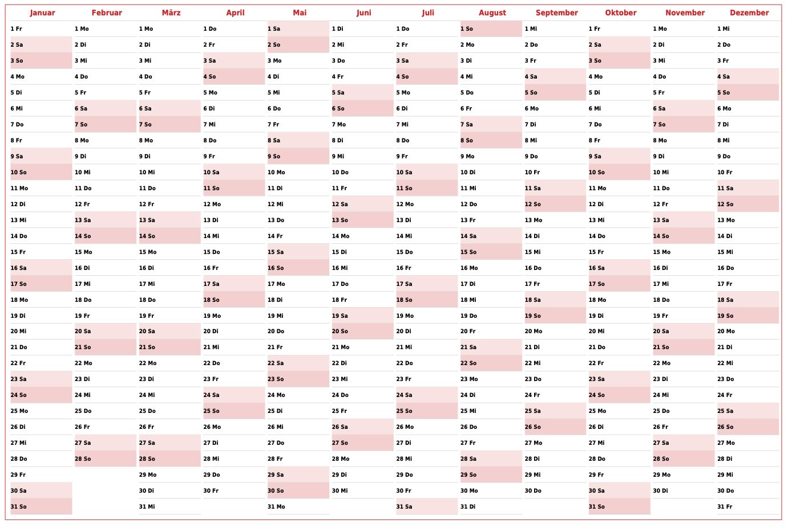
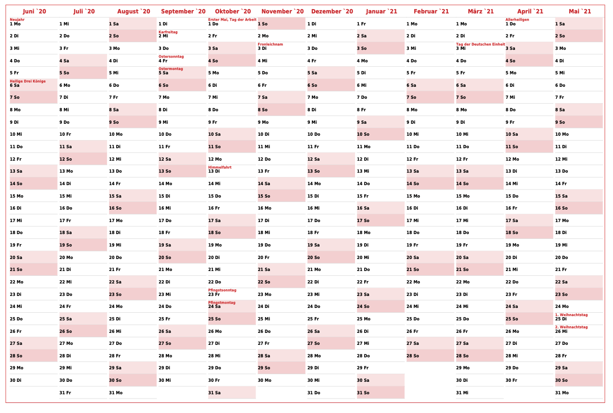

# CalendarGenerator
[](https://php.net/)
[](https://codecov.io/gh/lugark/CalendarGenerator)
[](https://sonarcloud.io/summary/new_code?id=lugark_CalendarGenerator)
[](https://sonarcloud.io/summary/new_code?id=lugark_CalendarGenerator)
[](https://sonarcloud.io/summary/new_code?id=lugark_CalendarGenerator)

The goal is to have a printable PDF with customized calendar including german school holidays and/or public holidays

## Dependencies
- PHP ^8.2
- Symfony 6.4
- "Feiertage" can be fetched from https://deutsche-feiertage-api.de/
- "Schulferien" can be fetched from [mehr-schulferien.de](https://www.mehr-schulferien.de/)
- [lugark/calendar-pdf-generator](https://github.com/lugark/calendar-pdf-renderer) to render the calendar
## Installaion
```
composer install
```

## Usage 
### Rendering the Calendar
To render a calender you need to provide at least a startdate:
```
bin/console calendar:generate 2020-01
```


If you want to render holidays like german bank holidays or school vacation you can provide it with either *--publicholidays* or *--schoolholidays*.
Both require the federal country to be specified (as those dates differ in germany)
```
bin/console calendar:generate --publicholidays BY 2020-01
```


### Calendar events
To also render holidays you can fetch the dates for public holidays from "Deutsche Feiertage API"  https://deutsche-feiertage-api.de 

```
bin/console calendar:fetch:holidays --year 2021 public
```

To fetch the dates for german school vacations from [mehr-schulferien.de](https://www.mehr-schulferien.de/)
```
bin/console calendar:fetch:holidays --year 2021 school
```
